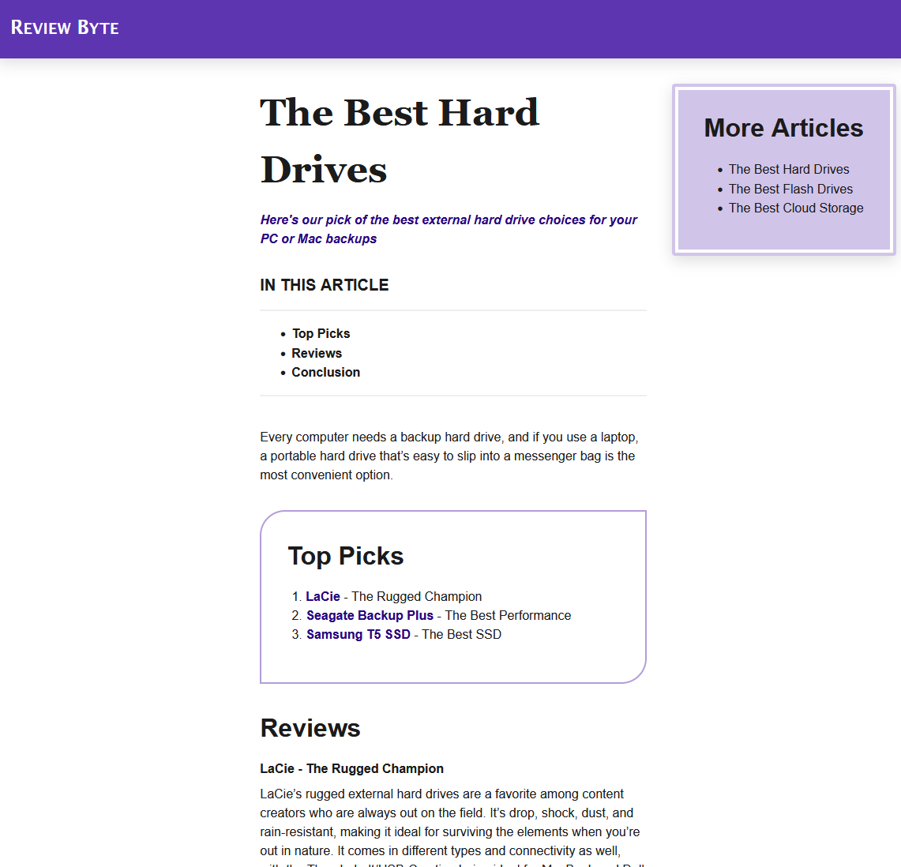

# Navigation Practice Exercise

In this practice exercise, you're asked to do the following:

1. Create 3 new HTML files. One for Flash Drives, one for Hard Drives and one for Cloud Storage
2. Add internal links in the index.html file's "More Articles" section to these new pages
3. Create external links to buy the "Top Picks" products from Amazon
4. Create anchor links to help the user navigate a single page easier

